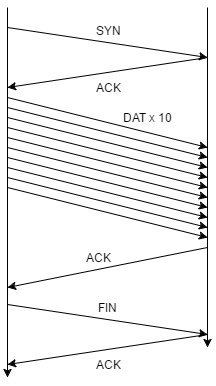
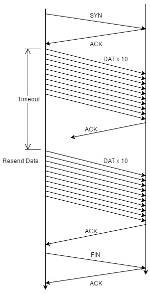
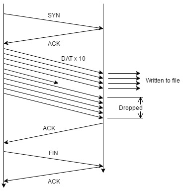

# **Reliable Datagram Protocol**

## Table Of Contents
1. INTRODUCTION
2. GETTING STARTED
3. DESIGN
   1. Header
   2. Connection Management
   2. Flow Control
   3. Error Control
4. ABOUT

# 1 INTRODUCTION
This Reliable Datagram Protocol (**RDP**) utilizes the UDP, but adds connection management,
flow control, and error control to allow a reliable connection and packet transfer.

This implementation was created for the final deliverable of the Computer Networks lab project (P2).
Many changes have been made since the first attempt at this project (P2a). The final design that was submitted
will be explained in **section 3** after getting started.

 I am pretty happy about the result of this lab. Though I sunk many.. many.. hours into this project,
 it has a lot of work to be done. Some of these future installments are explained in **section 4**.

 Thank you.

# 2 GETTING STARTED
This step involves the user to compile the program using the gcc compiler.
To make the program, the user must run the command `make`. This command compiles both
the `rdpr.c` and `rdps.c` files with the required helper files, which include `rdpHeader.h` and `rdp_functions.h`.
To clean the outputted files, simply run `make clean`

Once the user has compiled the file and has the executable, the program can be run by opening two
seperate terminals and running the following two commands:
    
    ./rdpr <receiver port> <receiver ip> [file to write to]
    ./rdps <sender ip> <sender port> <receiver ip> <receiver port> [file to send]
    
with these two commands the user is able to begin the program. Remember that the 
receiver should be ran first in order to begin listening to the sender.

# 3 DESIGN

## 3.1 HEADER
The following sections help answer the following questions:
1. How did you design and implement your RDP header and header fields?
2. Did you use any additional header fields?

#### 3.1.1 RDP Header Design
The header is designed to follow the structure outlined in the Assignment outline.

| Field   | Description                        |
| ------- | ---------------------------------- |
| magic   | RDP Protocol Indicated with CSC361 |
| SYN     | Synchronize Flag                   |
| ACK     | Acknowledgment Flag                |
| DAT     | Data Flag                          |
| RST     | Reset Connection Flag              |
| FIN     | Finish Connection Flag             |
| seqno   | Sequence Number                    |
| ackno   | Acknowledgment  Number             |
| length  | Length of Payload                  |
| window  | Sliding Window Size                |
| payload | Data Payload                       |

#### 3.1.2 RDP Header Implementation
The header is implemented with a structure that also includes the payload field (found in `rdpStruct.h`). Along with this structure are a number of functions to support it.
These functions take a string and add it to a struct, and initialize the structure with default values. Because the function is assumed to be transfering strings,
string functions are used throughout the implementation.

#### 3.1.3 Additional Fields
No additional fields were used for now.


## 3.2 Connection Management
The following sections help answer the following questions:
1. How did you design the connection management using SYN, FIN, and RST packets?
2. How did you choose the initial sequence number?

#### 3.2.1 Connection Management Design
The connection management for this RDP is through `SYN` and `FIN`. Originally, the `RST` flag was going to be used if the `SYN` packet failed, but a workaround was made making `RST` obsolete
in this implementation.

For this implementation, a one way synchronize is made since only the receiver aquires `DAT` packets. This is done by sending a `SYN` packet to the receiver,
and the receiver replying with an `ACK` packet back. When the connection is needed to be released, the sender sends a `FIN` packet to the receiver, who in turn replies with a `ACK` and releases
the connection. Once the sender receives the `ACK`, it releases it's connection.

This implementation uses a enumerated type stucture to store the current state of the system. These states direct the connection management to run the appropriate code for each segment of the connection establishment, as well as will be used for error control later.
The initial sequence number for the connection is 0, with acknowledgments adding 1 to these.

#### 3.2.2 Initial sequence number
The initial sequence number is chosen by the rand() function and modulo to pick a number between 1 and 500.

```
srand(time(NULL));
first_seq_num = rand()%500 + 1;
```

This range was chosen to show a random sequence number without it being rediculously large. When the program begins,
a random number is selected based on the time as its seed.

## 3.3 Flow Control
the following sections help answer the following questions:
1. How did you design the flow control using window size?
2. How did you choose the initial window size?
3. How did you read and write the file?

#### 3.3.1 Flow Control Design
The RDP flow control for this implementation works but is not efficient. The following will explain why it works and how it could be improved.

On the sender side, up to 10 packets are sent to the receiver before reaching the `select` function that watches for input.
These packets are sent with a sequence number equal to the last `ACK` ackno number, and increases by the max packet size of `1024`. This number is static because all packets are of size `1024` 
to keep simplicity (padding is added to each packet to assure it is the max packet size).

Upon receiving the 1-10 packets, the receiver parses the packets and adds the packet to a multidimensional character array. A timer is used on the receiver side with a short timeout.
This timer is used to control the program to go to the next stage if the packets stop being received from the sender. This is very inefficient, but my idea was to
keep each stage (or status) seperate to help with debugging and coding.

Next, the packet array is iterated through as the receiver looks for the next sequence number.
A priority queue can be used in later implementations to add efficiency to the program. Once the array has been checked for all possible sequence numbers, the highest
sequence number found (or the last sequence found before a missing packet's sequence number stops), an `ACK` is sent back to the sender. Unfortunatley, with this method, if a packet is lost
before the largest sequence number is found, then the missing packet and all greater are dropped. This could be avoided by sliding the contents of a priority queue
to the left by the number of packets that were successfully received, with the ACK and window size being sent back to the sender.



The image above shows the ideal flow for a file that requires only 1 set of 10 packets.

#### 3.3.2 Window Size
The window size is set to a static `10240` in order to keep things simple. The implementation sends up to 10 packets to the receiver, each with 1024 bytes (1KB). This means at no point the window size
should be passed as long as these static values are used.

#### 3.3.3 File Read And Write
This implementation uses a similar read to the previous assignment in which it opens the file in read mode and copies the contents to a buffer. Because of my lack of knowledge of maloc,
and the lack of time I have to implement the flow control, a large character array is used to store the file contents. After the system reads the file and copies it to the file buffer,
it is ready to send substrings of the buffer in the packets, with a size of `984` (data payload). On the receiver side, the use of `fread()` is be used to print to the destination file that is opened as write (with `fopen()`).

# 3.4 Error Control
the following section will answer the following questions: How did you design and implement the error detection, notification, and recovery?
1. How did you use the timer? How many timers?
2. How did it respond to the events at the sender and receiver sides?
3. How did you ensure reliable data transfer?

#### 3.4.1 Error Detection, Notification, and Recovery Design

Error detection for the sender is satisfied using a timer. If the timer runs out, the last 1-10 packets are resent. This can be shown in the image below.



Error detection for the receiver is done through the flow control process. Once the receiver believes it has aquired all the sent packets (through timeout), it iterates through the packets received.
As it iterates, it checks the sequence number of each to see if it is the next. If it runs through all packet combinations, it sends an ACK for the highest packet seen. If a packet is dropped on its way to the receiver,
the sequence check will not progress past the dropped packet. This leads to all packets past the dropped packet to drop as well. This is shown in the image below.



This can be made better by sliding the packets in the buffer to the left by the number of packets written, and an `ACK` can be sent for the packets missing. Because of the lack of time, this was not
completed.

#### 3.4.2 Timers
Two timers are used in this implementation. The sender uses a timer to resent packets if the ack was dropped. The receiver uses a timer to progress to the next stage of the reply if the number of received packets is less than 10.

#### 3.4.5 Ensuring Reliable Data transfer
Since the program is able to handle 10% loss rate for both send and receive because of the described error control above, it is reliablely able to send the file.

# 4 ABOUT
This program was written by Sean Burt for the University of Victoria Computer Networks class (csc361). Any questions can be answered by emailing seandburt (at) gmail.com. Thank you for reading.